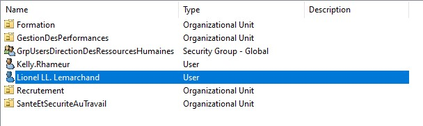
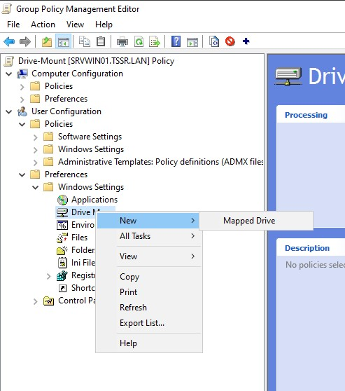

## Partie 1 : Gestion des utilisateurs  

**Q1.1.1**  
Pour ce faire, nous pouvons nous rendre dans l'OU où se trouve l'utilisatrice Kelly Rhameur, clic droit > **Copy** > puis rentrer les informations du nouvel utilisateur qui la remplace Lionel Lemarchand.

  

  
Une fois crée, nous nous rendons donc les **Properties** de chacun d'eux qui "transférer" les collaborateurs anciennement managés par Kelly Rhameur : depuis l'onglet **Organization** > *double-clic* sur l'utilisateur > **Change** > on insert le nom de Lionel Lemarchand > **Apply** (et ce pour chacun d'eux).
  

  
============================================================================================
  

  
  
**Q1.1.2**  
Ici, nous créeons l'OU **DesactivatedUsers** au niveau du domaine **TSSR.LAN** : clic droit sur le nom du domaine > **New** > **Organizational Unit** > "DesactivatedUsers" (on décoche la case de protection contre la suppression accidentelle).
Notre OU est créée : on commence par désactiver l'utilisatrice Kelly Rhameur > clic droit dessus puis **Disable Account**

  
**Q1.1.3**  
Nous revenons sur l'OU correspondant aux Ressources Humaines où se trouvait Kelly Rhameur, puis clic droit sur "GrpUsersDirectionDesRessourcesHumaines" > **Properties** > **Members** puis nous sélectionnons Kelly Rhameur et **Remove**.

  

  
**Q1.1.4**  
On se rend dans l'explorateur de fichier Windows, puis dans notre disque correspondant aux *DossiersIndividuels* : (F:).
Ici nous retrouvons le dossier personnel de Kelly Rhameur. Nous y créons un nouveau dossier que l'on appelle "lionel.lemarchand" en respectant la nomenclature en vigueur.
On clic-droit dessus, une fois crée, puis, **Properties** > **Security** > **Advanced**, ici nous désactivons l'héritage pour pouvoir ajuster finement les droits sur son répertoire.

  
Une fois réalisé, nous observons qu'il n'y a plus que le groupe *Administrators* qui a des droits dessus, alors nous ajoutons l'utilisateur Lionel Lemarchand, ajustons les droits et validons.

  
Pour le cas de Kelly, nous créons un répertoire que l'on nomme "archives", puis plaçons sor répertoire personnel à l'intérieur. Nous le renommons "kelly.rhameur-ARCHIVE".

  
  
**Q1.2.1**  
Nous retrouvons Gabriel Guhl dans la sous-OU *Finance*.
Pour ce faire, clic-droit sur l'utilisateur concerné > **Properties** > **Account** > **Logon Hours** > on sélectionne ici les heures qui nous intéressent, soit de 7h à 17h du Lundi au Vendredi, puis validons.

  
**Q1.2.2**  
Clic-droit sur l'utilisateur concerné > **Properties** > **Acount** > **Log On To** > on coche "The following computers", ajoutons le nom du client en question : CLIENT01, puis **Add**.

  
**Q1.2.3**  
Nous créons une stratégie de mot de passe pour durcir les comptes des utilisateurs de l'OU LabUsers : depuis Windows Server Manager, je me rends dans **Tools** puis **Group Policy Management**. Je clic-droit sur l'OU *LabUsers*, puis **Create a GPO in this domain, and link it here...**.

  
Je la nomme "GPO_durcissement_mdp".
Elle apparait alors, clic droit dessus, puis **Edit**. Je suis le chemin **Computer Configuration** > **Policies** > **Windows Settings** > **Security Settings** > **Password Policy**. A partir d'ici, je peux appliquer différentes règles pour durcir la politique des mots de passe des utilisateurs. Par exemple :

  
**Q1.3.1**  
Commençons par "mettre en partage" nos deux disques E et F : dans l'explorateur de fichiers, clic-droit sur chacun d'eux > **Properties** > **Sharing** > **Advances Sharing**, où nous cochons **Share this folder** et appliquons.

  
Nous retournons dans l'outil **Group Policy Management**.
Clic-droit sur **LabComputers** puis **Create a GPO in this domain, and link it here...**.
Nous la nommons "Drive-Mount".
Puis une fois créée, clic-droit puis **Properties**.
Nous suivons le chemin suivant : **User Configuration** > **Preferences** > **Windows Settings** > **Drive Maps**, ici clic droit dessus puis **New** > **Mapped Drive**

  
Nous remplissons la fenêtre qui s'ouvre avec :
 - Location : \\Srvwin01\e (même chose avec f)
 - Label as : nous pouvons indiquer "commun" ou "partage"
 - Use : on va sélectionner la lettre de lectuer qui correspond, donc E ou F.
On valide et nous avons actualisé la GPO :

  
Nous retournons dans **Group Policy Management** et observons l'application de la GPO sur les clients du domaine :

  

