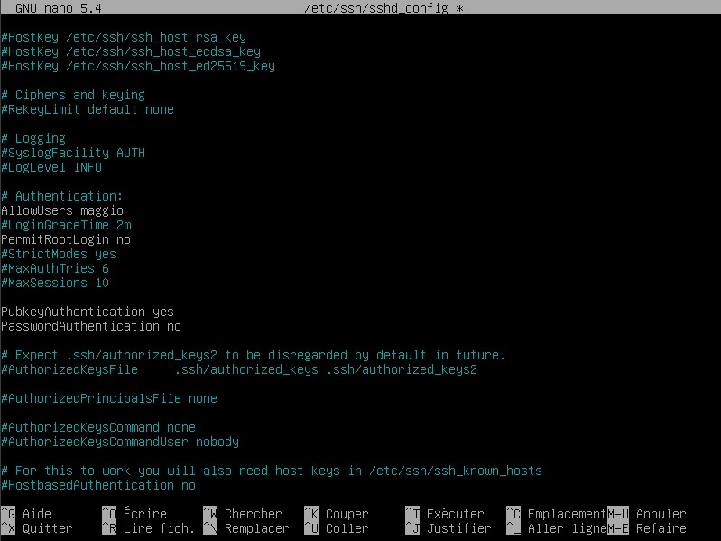
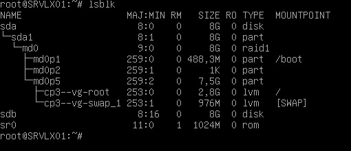

## Partie 1 : Gestion des utilisateurs  

**Q.2.1.1**  
J'utilise la commande ``adduser maggio``, donne un mot de passe et les informations optionnelles. Pusi je vérifie avec ``cat /etc/passwd`` : **maggio** est bien crée.  
  
  
**Q2.1.2**  
Je placerais cet utilisateur dans le groupe des sudoers (root) pour pouvoir au besoin administrer et configurer des fichiers lorsque cela sera nécessaire, par exemple *ssh* (il faudra alors le rentrer dans les *AllowUsers* du fichier /etc/ssh/sshd_config).

## Partie 2 : Configuration de SSH  
  
**Q2.2.1-2-3**  
  
Puis Ctrl+O, Yes, Ctrl+X (écrtiture puis sauvegarde du fichier) et on redémarre le service avec ``systemctl restart ssh``.  

## Partie 3 : Analyse du stockage  

  
  
**Q2.3.1**  
Les systèmes de fichier actuellement montés sont : ext2, ext4 et SWAP.  
  
  
**Q2.3.2**  
Les sytèmes de stockages utilisés sont du RAID1 et du LVM  
  
  
**Q2.3.3**  
Ici nous nous servons de l'utilitaire RAID Linux *mdadm*.
On observer l'état "dégradé", ce qui signifie qu'effectivement le RAID ne fonctionne pas correctement.  
  
  
On ajoute alors un nouveau disque de 8Go via le logiciel VirtualBox.
On test sa présence : ``sdb`` est bien là.  
  
  
On partitionne le nouveau disque : ``fdisk /dev/sdb`` > ``n`` (pour nouvelle partition) > ``p`` (pour primaire) > taille par défaut ici > ``t`` pour choisir le type de partition > ``FD`` pour la dédier au RAID1 que l'on souhaite mettre en place > ``w`` pour écrire la table de partition. ``sdb1``est créée.
On reprend avec l'utilitaire **mdadm**.
``mdadm --manage /dev/md0 --add /dev/sdb1`` : pour ajouter ``sdb1`` au raid existant ``md0``.
On vérifie avec la commande utilisée précédemment : ``mdadm --detail /dev/md0``. Ici il faut attendre quelques instants pour le "recovering" du RAID1, ce n'est pas instantanné.    

  
  
**Q2.3.4**  
Pour cela nous utilisons les commandes dédiées au LVM.
On commence par s'assurer de la place actuellement disponible dans le *Volume Group* ainsi que du nom de ce volume avec la commande ``vgs``. C'est bien le cas, car nous n'avons besoin "que" de 2Go, il se nomme **cp3-vg**.  

  
On procède alors à la création du volume que l'on nomme naïvement "sauvegarde1" :
``lvcreate -n sauvegarde1 -L 2G cp3-vg``  

  
Nous devons formater ce nouveau volume en système de fichier Linux *ext4* :
``mkfs -t ext4 /dev/cp3-vg/sauvergade1``  

  
Il ne reste plus qu'à monter le volume en question : ``mount /dev/cp3-bg/sauvegarde1 /var/lib/bareos/storage``
Puis que ce soit automatique à chaque démarrage, on modifie le fichier ``/etc/fstab``  

  
  
**Q2.3.5**  
Nous vérifions avec la commande ``vgs``: il reste ~1.79Go.    

  

## Partie 4 : Sauvegardes  

  
**Q2.4.1**  
**bareos-dir** : *director* il s'agit du serveur Bareos qui va diriger les opérations de sauvegarde, d'archivage et de restauration.
**bareos-sd** : *storage-daemon* c'est le serveur de base de données qui gère la lecture et l'écriture des sauvegardes. Il est responsable du stockage des données.
**bareos-fd** : *file daemon* ou client, il est donc installé sur les machines dont les données vont être sauvegardées. C'est lui qui "envoit" les fichiers au *sd*.  

## Partie 5 : Filtrage et analyse réseau  

  
**Q2.5.1**  
On applique la commande **nftables** suivante : ``nft list ruleset``  

  

Les règles qui apparaissent dans la liste sont de haut en bas :
 - Filtre tout ce qui arrive sur le *hook* input et *drop* tous les paquets qui ne correspondent à aucune règle établie. Cela correspond à la bonne pratique DENY ALL.
 - Accepte les paquets qui font partie de connexions déjà établies 
 - Rejète les paquets considérés comme "invalides" malgré la connexion établie
 - Accepte la communication via l'adresse loopback
 - Permet les connexions ssh
 - Accpete l'ICMP
 - Accepte l'ICMPv6
  
**Q2.5.2**  
Selon ce qui a été résumé précédemment, les communications autorisées sont : SSH (22), ICMP, ICMPv6 et les connexion déjà établies.
  
**Q2.5.3**  
Les connexions interdites sont : tout ce qui ne correspond pas aux communications autorisées, et les paquets considérés comme "invalides" lors de connexions déjà établies.
  
**Q2.5.4**  
Nous allons nous servir ici de la commande ``nft add rule inet <nomDeLaTable> in_chain <position_n-1> <regle>``. 
Il faut intégrer ces règles à la chaîne déjà existante et donc faire attention à l'ordre d'insertion. Nous considérons que le protocole TCP est concerné via les ports 9101, 9102 et 9103 :
``nft add rule inet inet_filter_table in_chain position 6 tcp dport { 9101, 9102, 9103 } accept``  

  

## Partie 6 : Analyse de logs  

  
**Q2.6.1**  
Nous utilisons la commande ``last`` avec l'option ``-n 10``pour afficher uniquement les 10 dernières :  

  
